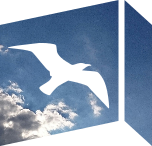

=======
Seagull
=======

Open-source skinnable photo gallery app.

.. note::
    This program is currently alpha, and detailed documentation is on its way.

Overview
========

Seagull is a simple generic photo gallery app with support for skinning and
easy maintenance of gallery and its metadata. The project is still incomplete
so don't expect anything to work 100% just yet. When it's finished, it will
have the following features:

- [x] Built on top of Python 3.5, no compromises made
- [x] Completely skinnable (CSS/HTML/JavaScript)
- [x] Fast asyncrhonous backend
- [x] Easy filesystem-based maintenance
- [x] Cross-platform support (Linux and Windows, OSX might work too)
- [ ] Static site generator
- [ ] Full support for social metadata
- [ ] Full user and developer documentation

Installing
==========

TODO

Documentation
=============

Seagull user guide can be found `on ReadTheDocs
<http://seagull.readthedocs.io/en/latest/>`_.

Starting and stopping
=====================

After installing, Seagull can be started with just::

    $ seagull

To run it 'professionally' (that is, as a proper daemon), use the following
command::

    $ seagull -b -q --pid-file PATH

The above command starts Seagull as a well-behaved daemon (``-b``), output 
suppressed (``-q``), and its PID written out to ``PATH``.

Type ``seagull --help`` for more command line options.

Skins: organization of static assets and templates
==================================================

Static assets and templates are organized into skins. Skin is a directory
structure that contains the assets and templates and has a name that can be
referred to by the application and its tooling.

Skins are normally found in ``seagull/skins`` directory. Each skin directory
contains the following structure::

    skin_dir/
        assets/
            css/
            js/
            img/
            font/
        templates/
        src/
            coffee/
            scss/

The ``assets`` directory contains the compiled CSS, JavaScript, images, and
fonts. The assets are compiled from the sources found in the ``src`` directory.
Compiling the assets from sources is optional, and not a requirement for a
valid skin. The templates are found in the ``templates`` directory.

Compiling static assets
=======================

The setup module (you can use setup.cmd on Windows) provides commands for
working with static assets.

==================  ===========================================================
setup watch         Start Compass and CoffeeScript watchers
------------------  -----------------------------------------------------------
setup stop          Stop the watchers
------------------  -----------------------------------------------------------
setup recompile     One-time recompile of all assets
==================  ===========================================================

The commands accept a ``--skin`` command line option which directs the Compass
and CoffeeScript commands to a specific skin directory. If no skin is
specified, 'seagull' will be used as default.

Additionally, ``--static-url`` can be used to specify the base URL path for 
static assets. The default is '/static/'. Note that this setting must match the
setting you will be used in the configuration file as the command will not try
to load the configuration file.
