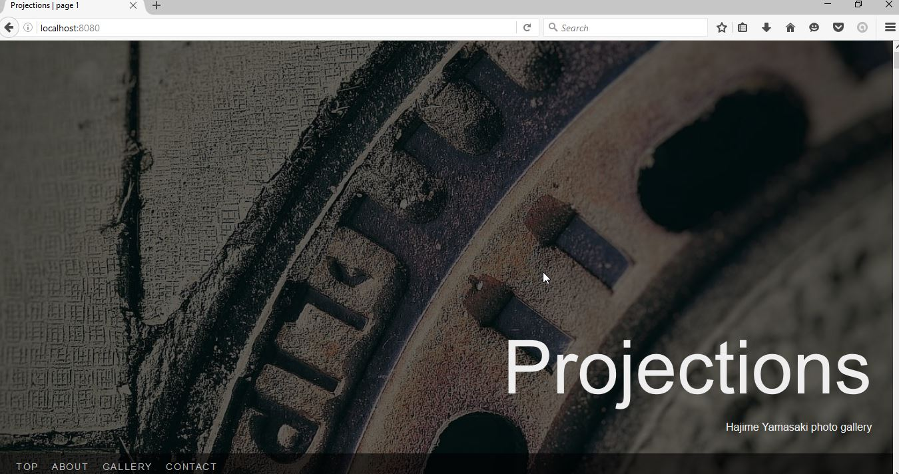
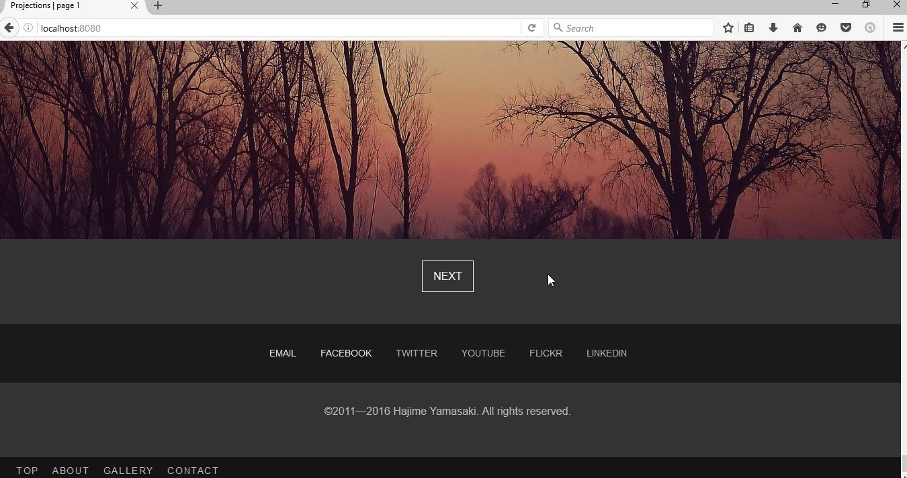

Customizing the configuration
=============================

You have no doubt noticed that in the :doc:`previous section <first_steps>` we
didn't change the title of the gallery, and some of the other bits and pieces.
These things are defined in the configuration file and we have to generate our
own in order to change these details.

Creating the custom configuration file
--------------------------------------

The ``seagull`` command we have been using has a shortcut for creating our own
configuration file. Let's try it::

    > seagull --custom-conf mygull.ini

Now let's open the file in an editor. The contents look like this::

    [config]

    defaults =
      /usr/lib/python3.5/site-packages/seagull/seagull.ini

    [seagull]

    # Add your settings below this line

The part that says ``/usr/lib/python3.5/...`` is going to be different
depending on what operating system you are on, and where Seagull is installed,
but it always points to the default configuration file.

.. note::
    Any setting that appears in the default configuration file can be
    overridden by your custom configuration file. You just need to make sure
    the appropriate section header exists in both (e.g., ``[seagull]`` in the
    above example) and that the setting you want to override is under the
    correct section.

Customizing the gallery metadata
--------------------------------

Let's change the gallery title, description, and some of the other information.
I'll use my own info here.

.. note::
    Quick tip: copy the options from the default configuration file so you have
    the comments that tell you what options do. It helps when you come back to
    it later and need to remember what something does.

All the important metadata go under the ``[seagull]`` section::

    [seagull]

    # Gallery title
    title = Projections

    # Gallery description
    description = Hajime Yamasaki photo gallery

    # Author of the content
    author = Hajime Yamasaki

    # Copyright year
    copyright = 2011

Restart with custom configuration
---------------------------------

We need to stop tha app (if it's running), and then restart it with the new
configuration file. This time, though, we need to tell it to use our own
configuration file instead of the default::

    > seagull --conf mygull.ini
    Starting Seagull
    Registering SIGINT handler
    Registering SIGTERM handler
    Preparing application to run
    Added JS bundle: app.js
    Added CSS bundle: app.css
    Setting up index for /tmp/seagull-gallery
    Omitted /tmp/seagull-gallery/_about.mkd from gallery
    Omitted /tmp/seagull-gallery/_contact.info from gallery
    Omitted /tmp/seagull-gallery/_cover.jpg from gallery
    Sorting items
    Added 11 items to the index
    Route gallery:main mapped to /
    Route gallery:image mapped to /gallery/<path:path>
    Route gallery:reindex mapped to /reindex/<token>
    Route app:static mapped to /static/<path:path>
    Server started on http://0.0.0.0:8080/
    Server started on http://0.0.0.0:8080/

.. note::
    By the way, lines that start with 'Omitted ...' are telling us that those
    files are omitted from the *gallery*, not that they are not used at all.

If we load `localhost:8080 <http://localhost:8080/>`_ now, we'll see our
changes applied.

You'll notice that the copyright year range is shown instead of just the year
we set. This range is always set to *your year - current year*.

Adding more settings
--------------------

We'll also use this opportunity to change the reindex password. The comment in
the default configuration file says that this password must be URL-friendly.
To keep it simple, we'll take this to mean that we can only use letters and
numbers and dashes (in reality, there are many more characters that can be
used, but discussing the full set of rules about what can and cannot be used in
an URL is outside the scope of this tutorial). ::

    [seagull]

    # Reindexing password: asked for when using the reindex page, must be 
    # URL-friendly
    password = my-new-password

We can also change the gallery folder path using the ``gallery_dir`` setting,
but I'll leave that to you to play with. :-)
