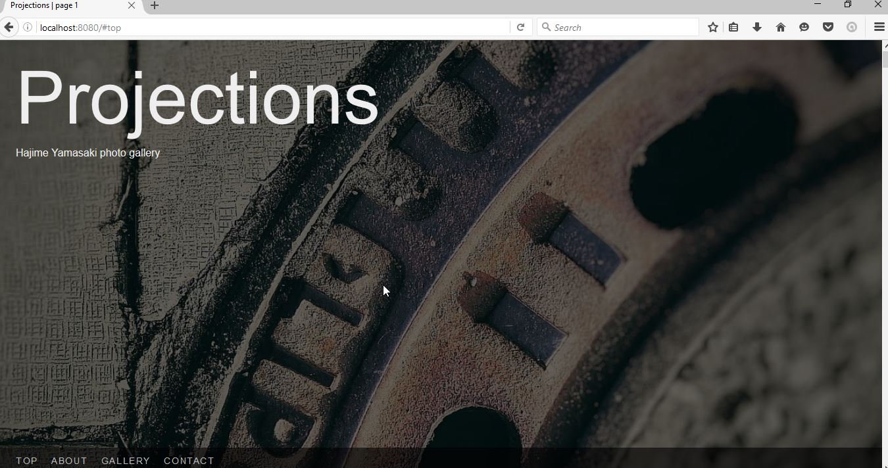

Customizing the styling
=======================

Styling and layout is defined by skins. Skins are folders with standardized
structure, that contain static assets, source code (if you use transpiled
languages like Compass and/or CoffeeScript), and (optionally) templates.

In this section, we'll take a look at setting up a skin folder, and lightly
touching up the default skin.

Creating the skin folder
------------------------

To create a skin folder, we'll use the ``custom-skin`` command. ::

    > seagull custom-skin myskin
    Created skin in 'myskin'

What this option does is it creates a copy of the default skin at the specified
path (in our case it's ``myskin``).

Skin folder structure
---------------------

Before going into the modification, let's take a look at the generated folder.

There are three folders inside the shiny new skin folder:

- ``assets`` - contains the (compiled) static assets
- ``src`` - contains the `Compass <http://compass-style.org/>`_ and/or 
  `CoffeeScript <http://coffeescript.org/>`_ sources
- ``templates`` - contains any HTML templates

The ``assets`` folder
~~~~~~~~~~~~~~~~~~~~~

If you intend to work with raw CSS and JavaScript, you will work in the
``assets`` folder. Otherwise, this folder will contain files generated by
Compass and CoffeeScript. Regardless of your approach, there is one important
file in the directory that you may want to modify: ``bundles.conf``.

The bundles file looks like this::

    app.js:
        main

    app.css:
        main

Each line that starts with a filename followed by a colon is a bundle. This
file contains two bundles: ``app.js`` and ``app.css``. You can have any number
of bundles but that depends on how your template is constructed. The default
template uses only those two bundles. Bundles cannot be nested, by the way.

The names after the bundle line, until the next bundle line, are paths of the 
JavaScript and CSS files that should be in the bundle. They don't have an
extension because the extension is picked up from the bundle name. The file
paths are looked up in the ``assets/js`` folder for ``.js`` bundles, and
``assets/css`` folder for ``.css`` bundles.

Let's say we have files ``menu.js`` and ``hero.js`` that we wish to combine
into the ``app.js`` bundle. To do this, we would copy the two files into the
skin's ``assets/js`` folder, and have this in the bundles file::

    app.js:
        menu
        hero

The bundle is created with the contents ordered exactly as specified, so if the
loading order matters for your files, you should make sure they are listed in
the correct order.

Similarly, for CSS, you can combine multiple files with something like::

    app.css:
        menu
        hero
        footer

If one of the files is in a subdirectory (e.g.,
``assets/css/footer/copyright.css``), then the bundle might look like this::

    app.css:
        menu
        hero
        footer/copyright

.. note::
    Slashes are always forward regardless of the operating system.

The ``src`` folder
~~~~~~~~~~~~~~~~~~

The ``src`` folder has two subfolders: ``coffee`` and ``scss``. They contain
the CoffeeScript and Compass sources, respectively. You can completely omit
this folder if you don't intend to use these fantastic technologies. Sure, not
everyone can handle awesome. :-)

The ``templates`` folder
~~~~~~~~~~~~~~~~~~~~~~~~

The ``templates`` folder contains templates. It starts off with a file named
``.empty`` (which can be safely removed), and it should contain templates that
you wish to override. The default templates are located where seagull is
installed (or cloned), in a folder named ``default_templates``. We'll discuss
modifying templates a bit later.

Setting the new skin
--------------------

We'll now go back to our configuration file, ``mygull.ini``, and edit it to use
our new skin::

    [seagull]

    ...

    # The skin to use
    skin = myskin

    # Directory that contains additional skins
    extra_skins = .

The ``skin`` setting selects ``myskin`` as the skin we want to use. The
``extra_skns`` points to a folder in which the ``myskin`` folder can be found.
We say ``.`` to make seagull look in the directory where we start it.

Let's try out the new settings:

.. code-block:: text

    > seagull --conf mygull.ini
    Starting Seagull
    Registering SIGINT handler
    Registering SIGTERM handler
    Preparing application to run
    Using skin 'myskin'
    Setting up index for /tmp/seagull-gallery
    Omitted /tmp/seagull-gallery/index.html from gallery
    Omitted /tmp/seagull-gallery/page2.html from gallery
    Omitted /tmp/seagull-gallery/_about.mkd from gallery
    Omitted /tmp/seagull-gallery/_contact.info from gallery
    Omitted /tmp/seagull-gallery/_cover.jpg from gallery
    Omitted /tmp/seagull-gallery/_static from gallery
    Sorting items
    Added 11 items to the index
    Added JS bundle: app.js
    Added CSS bundle: app.css
    Route gallery:main mapped to /
    Route gallery:image mapped to /gallery/<path:path>
    Route gallery:reindex mapped to /reindex/<token>
    Route app:static mapped to /static/<path:path>
    Server started on http://0.0.0.0:8080/
    Server started on http://0.0.0.0:8080/

You will notice that this time seagull says ``Using skin 'myskin'`` to let us
know that the new skin is being used. Reloading the gallery page does not do
anything yet, though, because ``myskin`` is still unmodified.

Editing CSS and JavaScript directly
-----------------------------------

If you wish to work with CSS and JavaScript directly, you can skip to the next
section after reading this heading. I also won't talk about directly editing
CSS and JavaScript at length as I believe readers who choose this option will
be more than capable of figuring things out on their own.

The only thing I am going to note is that, if you are editing the code
directly, you will probably find the bundles file essential to your workflow.
The bundles file combines and minifies listed assets into singular files
(bundles), and also takes care of cache busting.

.. note::
    Cache-busting in Seagull is performed by the webassets library it uses.
    You can read more about the technical details of how it works `in the
    webassets documentation
    <http://webassets.readthedocs.io/en/latest/expiring.html>`_.

Starting the code compilers
---------------------------

The code compilers compile Compass and CoffeeScript code and dumps the compiled
versions of CSS and JavaScript into the ``assets`` folder. 
If you've never used Compass before, don't worry. It's just CSS with additional
bells and whistles, and if you followed the installation guide closely, you'll
have everything you need for a pleasant development experience.

Before we start hacking at the Compass code, we'll start the watching compiler.
The watching compiler will monitor the files and will recompile the code as
soon as changes are detected. 

.. note::
    It is recommended that you keep seagull running in one console, and start
    the watcher in another one so that you can preview the changes immediately.

Enough talk, let's start the watcher::

    > seagull watch --skin-path myskin
    starting watchers
    using skin in '/path/to/myskin'
    12:59:26 PM - compiled /path/to/myskin/src/coffee/main.coffee
    >>> Compass is watching for changes. Press Ctrl-C to Stop.

.. note::
    The ``python setup.py`` portion of the command can be replaced with
    ``./setup.py`` on Linux and Mac, or ``setup`` on Windows.

Depending on your computer speed, the output may take a while to appear, and
the console prompt may appear before the last line of the example output is
printed on your screen. The watcher is not fully started until you see the
``>>> Compass`` line.

Editing the Compass code
------------------------

Now we are ready to start customizing the skin. We first want to get rid of the
animation on the title and description, because they don't work so well for our
long-ish title.

The top portion of the page (the one that has the cover image) is called a
'hero' area, and the code for it is found in ``src/scss/_hero.scss``. In that
file, find and remove the following lines:

.. code-block:: css

    .title {
      ...
      @include transform(translateX(0));          <-- this
      @include animation(6s ease-out fly-in);     <-- and this
    }

    .description {
      ...
      @include transform(translateX(0));          <-- this
      @include animation(8s ease-out fly-in);     <-- also, this
    }

Once the file is saved, we should see the change in the console where the
watchers are running. ::

     modified myskin/src/scss/_hero.scss
     write myskin/assets/css/main.css

Refreshing the page, we see that the animation is no longer there. Good. Now I
want the title and subtitle to be at the top of the page, and left-aligned.
The modified portions now look like this::

    .title {
      position: relative;
      z-index: 1;
      font-size: 400%;
      line-height: 100%;
      padding: 2rem 2rem 1rem;
      ...

    .description {
      position: relative;
      z-index: 1;
      white-space: nowrap;
      padding: 0 2rem;
      ...

Stopping the watchers
---------------------

Now that we are satisfied with the changes we can stop the watchers.

It's important to note that the watcher is now running in the background. You
can type additional commands in the same console, for example. Simply closing
the console may not stop them, so let's see how to stop the watcher properly::

    > seagull stop-watchers
    stopping watchers

That's it. Now the watchers are stopped.
