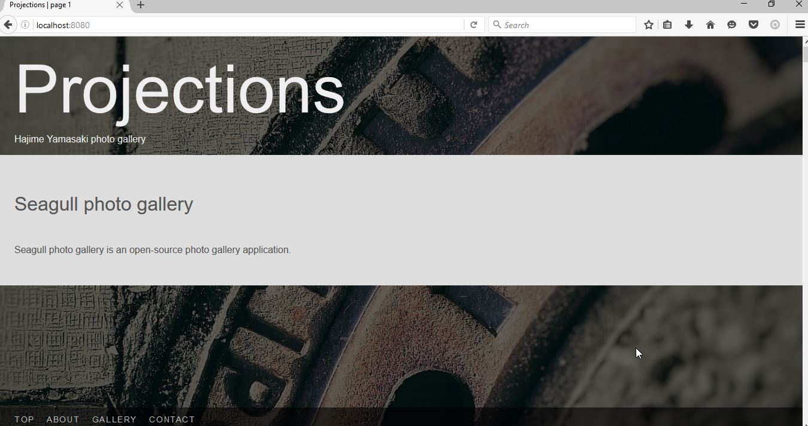
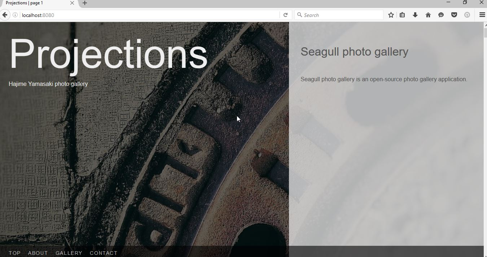

Customizing the templates
=========================

Due to the pages' simple structure, even just using CSS, a lot of customization
ca be made. But in some cases, modifying the template can be the only way to
achieve something.

In this section, we'll modify our Projections gallery to have the about text
appear in the hero area as a column on the right instead of in a strip at the
bottom of the page. This will require a change in both the templates and the
stylesheet, so let's fire up the watchers again.

The tour of the templates
-------------------------

Before we start hacking at templates, I will give you a brief tour of what each
template does. First lets locate the templates::

    > seagull templates
    /usr/lib/python3.5/site-packages/seagull/skins/seagull/templates
    /usr/lib/python3.5/site-packages/seagull/default_templates

The first path is always the skin's template folder, and the second one is the
one we are interested in: the default templates folder. This folder contains
the following files:

- ``_contact.mako``
- ``_images.mako``
- ``_paging.mako``
- ``base.mako``
- ``main.mako``
- ``reset.mako``

.. note::
    All templates are written for the `Mako
    <http://docs.makotemplates.org/en/latest/>`_ template engine. If you want
    to seriously hack at the templates, you should be familiar with `Python
    <https://docs.python.org/3/>`_ and `HTML
    <https://developer.mozilla.org/en-US/docs/Web/Guide/HTML/HTML5>`_, and, of
    course, the Mako syntax rules.

These are not all different pages. There are actually only two different page
templates: ``reset.mako`` (which we don't really care about) and ``main.mako``
which is applied to *all* gallery pages. The other templates are support
(partial) and base templates.

The ``base.mako`` template provides the outer shell for all the pages. It
contains the common bits like the docstring, HTML tag, footer, and so on.

The ``main.mako`` is the template that glues together the base and the inner
bits and pieces such as the contact list, about section, the image list, and
the pager.

``_contact.mako`` contains fragments for the contact list.

``_images.mako`` contains fragments for the gallery's image list.

``_paging.mako`` contains fragments for the pager at the bottom of the page.

Modifying the hero layout
-------------------------

Now let's modify the hero layout according to our original plan. First we will
copy the ``main.mako`` from the default templates folder to our skin's
``templates`` folder.

When we optn the file in our editor, we see the following bit:

.. code-block:: mako

    %if pager.is_first and metadata.about:
        <section id="about" class="about">
        ${metadata.about | n,unicode}
        </section>
    %endif

In Mako parlance, this says that the about section is only shown on the first
page and when the about metadata is available. We want this whole block to move
into the hero area, so we'll cut it and paste it just below the description.

.. code-block:: mako

    ...
        ${metadata.description}
    

    %if pager.is_first and metadata.about:
        <section id="about" class="about">
    ....

Template changes are applied immediately, so we can reload the page and see the
results right away.

Of course, without assistance from some CSS we cannot make our layout happen.
We'll start the watcher and edit ``src/scss/_about.scss`` in our skin folder to
adjust the about section layout. ::

    .about {
      display: block;
      position: fixed;
      right: 0;
      top: 0;
      bottom: 0;
      width: 40%;
      @include box-sizing(border-box);
      z-index: 1;
      background: transparentize($light-grey, 0.2);
      padding: 2rem;
      color: $dark-grey;
    }

We'll let the watchers recompile the stylesheet and preview our result.

We'll just make one more adjustment, and hide the about link in the navigation
menu when we are on the first page. The part of the ``main.mako`` template that
deals with this is::

    <nav id="navigation" class="navigation">
        ....
        %if metadata.about:
            <a href="${prefix}#about">About</a>
        %endif
        ...
    </nav>

Right now, it only checks that there is about metadata, and shows the link in
that case. We also want to hide it on the first page, because the about
information is already shown at the top. Therefore, we edit the link to look
like this::

    %if not pager.is_first and metadata.about:

The above line will work correctly, but it's a little ambiguous. Is it saying
'not first page and not metadata.about' or 'not (first page and 
metadata.about)'? There is a better way to express this thought::

    %if page.has_prev and metadata.about:

If we are not the the first page, then there are previous pages, so this gives
us the same result.

You'll forgive me for leaving unfixed styling issues in interest of brevity,
and let me conclude this section at this point. :-)
