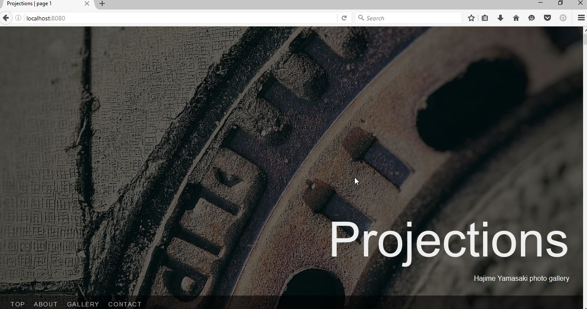

First steps
===========

In this section, we'll take Seagull for a quick step, and do some fairly basic
'customization', simply by manipulating the gallery folder.

Ignition!
---------

Let's quickly start up Seagull and see what that does. In your console, type::

    > seagull
    Starting Seagull
    Registering SIGINT handler
    Registering SIGTERM handler
    Preparing application to run
    Added JS bundle: app.js
    Added CSS bundle: app.css
    Quitting, no gallery directory '/tmp/seagull-gallery'

So that was a bit underwhelming. It's missing a gallery folder at its
default location, which is ``/tmp/seagull-gallery`` (or
``C:\tmp\seagull-gallery`` on Windows). Thankfully, this is easy to fix. Let's
create the folder where it wants it and try again::

    > seagull
    Starting Seagull
    Registering SIGINT handler
    Registering SIGTERM handler
    Preparing application to run
    Added JS bundle: app.js
    Added CSS bundle: app.css
    Setting up index for /tmp/seagull-gallery
    Sorting items
    Added 0 items to the index
    Route gallery:main mapped to /
    Route gallery:image mapped to /gallery/<path:path>
    Route gallery:reindex mapped to /reindex/<token>
    Route app:static mapped to /static/<path:path>
    Server started on http://0.0.0.0:8080/
    Server started on http://0.0.0.0:8080/

Now that's more like it. It does say 'Server started' twice, but it's only
starting once. It's a bug. To access Seagull, let's open our favorite browser
(Firefox, of course) and browse to `localhost:8080 <http://localhost:8080/>`_.

To stop the gallery app, press Ctrl-C in the console where you started it. ::

    ...
    Server started on http://0.0.0.0:8080/
    Server started on http://0.0.0.0:8080/
    Server stopped

For now let's start it up again and keep it running while we fiddle with it.

Adding the cover
----------------

The screen looks deliciously dark, but I'm pretty sure not everyone enjoys
dark. Let's add a cover image. Pick any JPEG image that's fairly large (say,
1600px by 1200px) and put it in the gallery folder. Rename the image to
``_cover.jpg``.

.. note::
    Only JPEG images are supported for covers at this time, and it will likely
    remain that way for foreeseable future. This can be fixed relatively easily
    through skinning, though.

Let's reload the page.

It already looks presentable. You will notice that the two bottom links don't
do much. This is because there are no photos in the gallery.

Adding the photos
-----------------

To add the photos to the gallery, we simply dump a bunch of JPEG, PNG, or GIF
images into the gallery folder.

.. image:: img/gallery-folder.jpg
    :alt: File manager showing the gallery folder

Let's reload the page.

But wait. There are still no photos. This is because, unlike the cover page,
the photos in the actual gallery need to be reindexed before they will show up.
It would be too CPU-intensive if we did this every time we load the page, so we
do it only as needed. To trigger the indexing, we use a magic URL:
`localhost:8080/reindex/reindex-now-1234
<http://localhost:8080/reindex/reindex-now-1234>`_ (the part that says
'reindex-now-1234' is configurable, and we'll get to that in the next section).
Once we go to that page, we will see a message about gallery being rescanned.

.. image:: img/rescanned.jpg
    :alt: 'Gallery was rescanned' message

After approximately 5 seconds, we are back in the main page. If we now scroll
down or use the 'gallery' link, we will see our photos.

.. image:: img/gallery-with-photos.jpg
    :alt: Gallery with photos loaded

The photos are ordered in lexical order (or in plain English: alphabetically).
All you need to do in order to change the image order is to change the file
names.

Adding the 'About' section
--------------------------

Seagull supports adding an 'About' section that appears right below the cover
image on the start page. The about section is written in `Markdown
<http://daringfireball.net/projects/markdown/>`_, so it's helpful to know `its
syntax <http://daringfireball.net/projects/markdown/syntax>`_. Let's open up an
editor and add some text for a short about section:

.. code-block:: markdown

    ## Seagull photo gallery

    Seagull photo gallery is an open-source photo gallery application.

We'll save this file in our gallery folder and name it ``_about.mkd``.

As with the photos, we need to reindex the gallery. Once the gallery is
reindexed, and we reload the page, we see that there is a new link in the menu,
and that our text has been rendered as a section below the cover page just like
promised.

Changing the site metadata
--------------------------

There is one more thing that we can add using the gallery folder and that's
the site metadata. The metadata affect the following:

- site title
- site description
- author name
- copyright year
- contact links section

This is done by adding a file named ``_about.info`` to the gallery folder. The
structure of the file is best explained using an example:

.. code-block:: text

    title: Projections
    description: Hajime Yamasaki photo gallery
    author: Hajime Yamasaki
    copyright: 2011
    email: hayavuk@gmail.com
    facebook: hayavuk
    twitter: foxbunny
    flickr: foxbunny
    linkedin: brankovukelic
    youtube: UC7OFFqXeuvvlRIXGkK4jMsQ

The above example contains all the supported metadata and contact link
information. The order does not matter, but the names on the left have to be
exactly as they appear there and must be all lower-case. For contact links, you
always type in the last portion of the profile address (the bit after the last
slash: /) on the right-hand side.

Now, let's save this file in our gallery folder as ``_about.info``.

After reindexing and reloading the page, the menu contains the contact link,
the gallery title and description are updated, and contact links section
appears at the bottom of the page.

.. image:: img/custom-footer.jpg
    :alt: The _about.info file in the gallery folder
